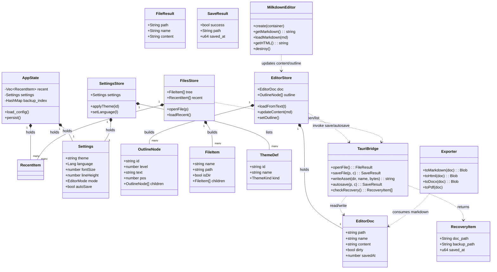
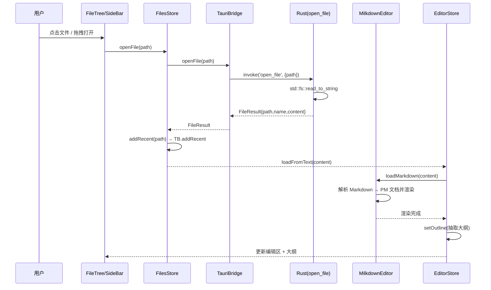
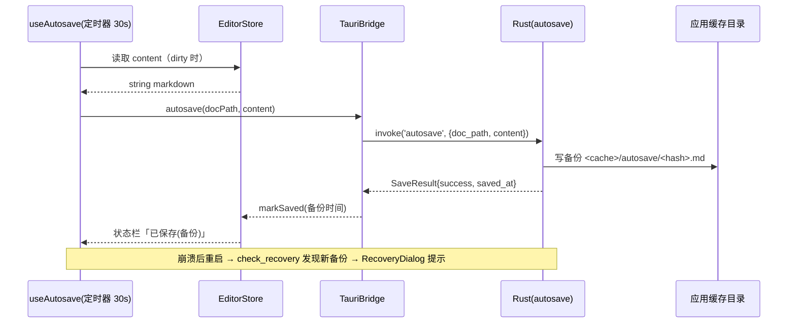
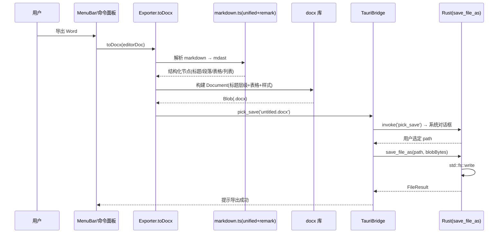
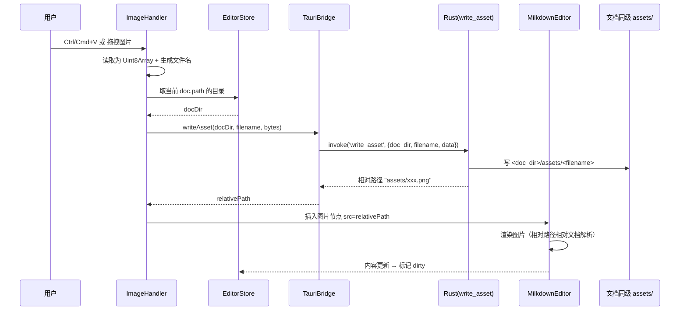
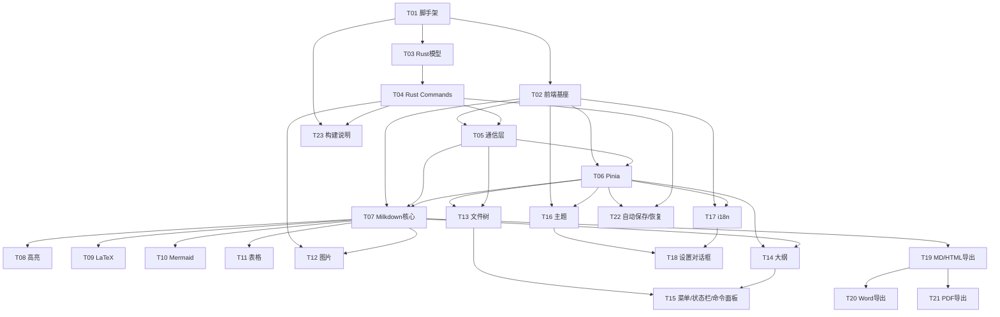

# 架构设计：Typo —— Typora 风格 WYSIWYG Markdown 编辑器（v1）

> 文档版本：v1.0
> 作者：高见远（Gao，架构师）
> 日期：2024-10-09
> 输入：PRD v1.0（许清楚）+ 主理人已锁定技术决策
> 工作目录（项目根）：`/home/Macro/Work/js/src/github.com/maczh/typo`

---

## 0. 总览与技术决策采纳声明

主理人已锁定的决策 **全部采纳**，并在本设计中细化落地：

| 决策 | 本设计落地方式 |
| --- | --- |
| 桌面：Rust + Tauri v2 | `src-tauri/`（Rust 工程）+ `src/`（Vue 工程），前后端经 Tauri `invoke` 通信 |
| 页面：Vue3 + Vite + TS | `src/` 下标准 Vite + Vue3 + TS 工程 |
| WYSIWYG：Milkdown | ProseMirror 内核，Markdown 为 source of truth；自封装 `milkdown/setup.ts` + 插件扩展 |
| 导出 HTML / PDF / Word | HTML 原生序列化；PDF 走 WebView 打印；Word 用 `docx` 纯 JS 库 |
| 多语言 3 种 | vue-i18n，zh-CN / en / zh-TW，框架可扩展 |
| 图片本地相对路径 | Tauri `write_asset` command 落盘到 `assets/`，插入相对路径节点 |
| 依赖体积 | KaTeX + Mermaid 懒加载；highlight.js 仅打包 20+ 语言；Shiki 留后续 |

**架构分层**：

```
┌────────────────────────────────────────────────────────────┐
│  Vue3 SPA (src/)   UI / WYSIWYG / 导出逻辑 / 状态管理       │
│   ├─ Milkdown Editor（ProseMirror，Markdown 为真相源）       │
│   ├─ Pinia stores / vue-i18n / 导出 utils                    │
└───────────────────────────┬────────────────────────────────┘
                            │  @tauri-apps/api/core invoke()
┌───────────────────────────┴────────────────────────────────┐
│  Rust + Tauri v2 (src-tauri/)   系统能力 / 文件 IO / 状态    │
│   ├─ Commands（open/save/asset/settings/recent/recovery）    │
│   ├─ AppState（最近文件、设置、备份索引，持久化到磁盘）       │
│   └─ 依赖：tauri, tauri-plugin-dialog，std::fs 直接读写       │
└────────────────────────────────────────────────────────────┘
```

**前后端职责边界**：
- **前端负责**：所有渲染、WYSIWYG 编辑、Markdown ⇄ PM 转换、大纲抽取、导出（HTML/Word/PDF）的**内容生成**、i18n、主题、UI 状态。
- **后端（Rust）负责**：文件读写（打开/保存/另存为）、二进制资源落盘（图片）、最近文件/设置/备份的**持久化**、系统对话框（打开/保存路径选择）、自动保存的落盘与崩溃恢复索引。

---

## 1. 实现方案 + 框架选型

### 1.1 关键技术难点与选型

| 难点 | 方案 | 理由 |
| --- | --- | --- |
| WYSIWYG 引擎 | **Milkdown**（@milkdown/crepe 或 @milkdown/core + preset-commonmark + preset-gfm + theme-nord + 自扩展插件） | ProseMirror 内核成熟；原生以 Markdown 为 source of truth；有 Vue 适配；社区插件丰富（LaTeX/Mermaid/图表） |
| 数学公式 | **KaTeX** | 体积小、渲染快、覆盖 LaTeX 常用集（≥95%）；离线打包 |
| 图表 | **Mermaid** | 常用流程图/时序图/类图渲染；**按需懒加载**控制体积 |
| 代码高亮 | **highlight.js**（轻量子集 20+ 语言） | 比 Shiki 体积小，离线友好；Shiki 留后续升级 |
| 导出 Word | **docx**（纯 JS） | 前端构建 .docx，保留标题层级与表格；无需 Pandoc/LibreOffice |
| 导出 HTML | unified + remark/rehype 管线 | markdown→HTML 一致、可离线、可接 rehype-highlight |
| 导出 PDF | WebView `window.print()` + 打印样式 | Tauri v2 无内置 print-to-pdf，走系统打印对话框「存储为 PDF」最稳 |
| 多语言 | **vue-i18n** + 3 语言包 | 框架可扩展至 30+ 语言 |
| 状态管理 | **Pinia** | Vue3 官方推荐，按 editor/files/settings 分域 |
| 文件 IO | Rust `std::fs` + `tauri-plugin-dialog` | 简洁、全权限；对话框走 dialog 插件 |
| 配置/状态持久化 | Rust 将 JSON 写入 `app_config_dir()` | 最近文件、设置、备份索引持久化 |

### 1.2 架构模式
- 前端：**组件化 + 单向数据流**（Pinia 为单一可信源；Milkdown 文档为「内容真相源」，UI 派生）。
- 后端：**Command/Handler 模式**（Tauri command 即 RPC 端点，无领域服务层复杂度）。
- 进程间：**异步 RPC**（前端 `invoke` → Rust `async fn`，`Result<T, String>` 错误上浮）。

### 1.3 Tauri v2 工程结构要点
- `src-tauri/Cargo.toml`：`[build-dependencies] tauri-build`，`[dependencies] tauri = { version = "2", features = [...] }`，`tauri-plugin-dialog`，`serde`，`serde_json`，`tokio`。
- `src-tauri/build.rs`：`fn main() { tauri_build::build() }`。
- `src-tauri/tauri.conf.json`：v2 schema，`productName`、`identifier`、`bundle`、窗口默认尺寸、devUrl / frontendDist。
- `src-tauri/capabilities/default.json`：声明 `core:default`、`dialog:allow-*` 等权限（v2 强制 capabilities 模型）。
- `src-tauri/src/lib.rs`：`pub fn run()` 注册 commands 与管理 `AppState`。
- `src-tauri/src/main.rs`：`fn main() { typo_lib::run() }`。

### 1.4 关键技术风险与缓解（概览，详见 §8）

| 风险 | 缓解 |
| --- | --- |
| 本机 Linux 缺 Rust/webkit2gtk，无法 `tauri build` | 产出**全部源码 + 完整构建说明**（降级方案，见 §8.1） |
| Mermaid 体积大 | 动态 `import()` 懒加载，构建 code-split |
| Milkdown 中文 IME 兼容 | 锁定较新 milkdown 版本，编辑区用 composition 友好配置，实测 |
| PDF 跨平台打印差异 | v1 统一走 `window.print()`，文档说明各平台选择「存储为 PDF」 |
| 安装包 <30MB | KaTeX 字体子集化、Mermaid 懒加载、highlight.js 裁剪语言；接受 v1 适度超出 |

---

## 2. 文件列表及相对路径

项目根：`typo/`。以下为**将创建的全部文件**及其职责。

```
typo/
├── package.json                  # 前端依赖与脚本（dev/build/tauri）
├── vite.config.ts               # Vite 配置（含 Tauri 适配、别名、code-split）
├── tsconfig.json                # 前端 TS 配置
├── tsconfig.node.json           # Vite 节点 TS 配置
├── index.html                   # Vite 入口 HTML
├── .gitignore
├── README.md                    # 构建与运行说明（含降级交付）
├── build-env.md                 # 各平台环境依赖清单与构建步骤（降级方案文档）
│
├── src-tauri/                   # ── Rust 后端（Tauri v2）──
│   ├── Cargo.toml               # Rust 依赖与产物配置
│   ├── build.rs                 # tauri-build 构建钩子
│   ├── tauri.conf.json          # Tauri v2 应用配置（窗口/bundle/capabilities 引用）
│   ├── capabilities/
│   │   └── default.json         # 权限能力声明（core/dialog/fs 等）
│   ├── icons/                   # 应用图标（build-env.md 说明占位生成）
│   │   └── .gitkeep
│   └── src/
│       ├── main.rs              # 程序入口，调用 lib::run()
│       ├── lib.rs               # run()：Builder、注册 commands、管理 AppState
│       ├── models.rs            # 可序列化结构体（FileResult/RecentItem/Settings/SaveResult/...）
│       ├── state.rs             # AppState（recent、settings、备份索引）+ 磁盘读写
│       └── commands/
│           ├── mod.rs           # 聚合导出所有 command
│           ├── file.rs          # open_file / save_file / save_file_as / list_dir / pick_open / pick_save
│           ├── asset.rs         # write_asset / get_assets_dir
│           ├── settings.rs      # load_settings / save_settings
│           ├── recent.rs        # list_recent / add_recent / clear_recent
│           └── recovery.rs      # autosave / check_recovery / clear_recovery
│
└── src/                         # ── 前端（Vue3 + Vite + TS）──
    ├── main.ts                  # 应用启动：createApp + Pinia + i18n + 挂载
    ├── App.vue                  # 根组件：布局壳 + 全局 provider
    ├── vite-env.d.ts            # Vite 类型声明
    │
    ├── types/
    │   └── index.ts             # 核心 TS 类型（EditorDoc/OutlineNode/FileItem/RecentItem/Settings/ThemeDef/...）
    │
    ├── stores/
    │   ├── editor.ts            # 当前文档、内容、dirty、大纲、光标
    │   ├── files.ts             # 文件树、最近文件、当前目录
    │   └── settings.ts          # 主题/语言/编辑器偏好/自动保存设置
    │
    ├── composables/
    │   ├── useTauri.ts          # 封装所有 invoke 调用（统一错误→toast）
    │   ├── useMilkdown.ts       # 创建/销毁 Milkdown 编辑器实例，绑定 store
    │   ├── useRecentFiles.ts    # 最近文件读写联动（基于 useTauri）
    │   └── useAutosave.ts       # 30s 定时自动保存 + 备份
    │
    ├── components/
    │   ├── layout/
    │   │   ├── AppLayout.vue    # 三栏布局（侧栏 / 编辑区 / 右栏）+ 菜单/状态栏插槽
    │   │   ├── MenuBar.vue      # 文件/编辑/视图/格式/主题/帮助菜单
    │   │   └── StatusBar.vue    # 字数、行列、主题、语言、保存状态
    │   ├── sidebar/
    │   │   ├── SideBar.vue      # 左侧容器（文件树/大纲 Tab 切换）
    │   │   ├── FileTree.vue     # 文件树浏览 + 打开 + 拖拽
    │   │   └── OutlinePanel.vue # 大纲树，点击跳转
    │   ├── editor/
    │   │   ├── EditorPane.vue   # Milkdown 挂载容器 + 模式（focus/typewriter/source）
    │   │   ├── TableToolbar.vue # 表格可视编辑浮层（增删行列/对齐）
    │   │   └── ImageHandler.vue # 粘贴/拖拽图片处理（调 write_asset）
    │   ├── panels/
    │   │   └── RightPanel.vue   # 右栏（大纲/预览/搜索，可折叠）
    │   ├── command/
    │   │   └── CommandPalette.vue # Ctrl/Cmd+Shift+P 命令面板
    │   └── dialogs/
    │       ├── RecoveryDialog.vue # 崩溃恢复提示
    │       └── SettingsDialog.vue # 设置对话框
    │
    ├── milkdown/
    │   ├── setup.ts             # createEditor：preset-commonmark + gfm + theme + 插件装配
    │   └── plugins/
    │       ├── latex.ts         # KaTeX 行内/块级数学节点
    │       ├── mermaid.ts       # Mermaid 图表节点（懒加载 mermaid）
    │       ├── highlight.ts     # highlight.js 代码块高亮
    │       ├── image.ts         # 图片节点（相对路径 + 落盘钩子）
    │       └── table.ts         # 表格节点 + 编辑器工具栏指令
    │
    ├── utils/
    │   ├── file.ts              # 路径处理（文件名/目录/相对路径换算）
    │   ├── outline.ts           # 从 PM 文档抽取大纲（OutlineNode[]）
    │   ├── markdown.ts          # Markdown ⇄ 中间结构辅助（导出复用）
    │   └── exporter/
    │       ├── index.ts         # 导出统一入口（按格式分发）
    │       ├── toMarkdown.ts    # PM/Markdown → .md（原生序列化）
    │       ├── toHtml.ts        # Markdown → 独立 .html（含样式/高亮/公式/图）
    │       ├── toDocx.ts        # Markdown → .docx（docx 库，标题层级+表格）
    │       └── toPdf.ts         # 注入打印样式 → window.print()
    │
    ├── i18n/
    │   ├── index.ts             # createI18n + 语言注册 + 持久语言
    │   └── locales/
    │       ├── zh-CN.ts         # 简体中文
    │       ├── en.ts            # English
    │       └── zh-TW.ts         # 繁體中文
    │
    └── styles/
        ├── variables.css        # CSS 变量（颜色/字号/间距/主题变量约定）
        ├── app.css              # 全局布局与基础样式
        ├── print.css            # 打印/PDF 专用样式
        └── themes/
            ├── github-light.css # 内置亮色主题
            └── nord-dark.css    # 内置暗色主题（基于 @milkdown/theme-nord 调校）
```

> 文件总数约 **55+**，结构按「后端 Rust / 前端 壳 / 状态 / 编辑器 / 导出 / i18n / 样式」清晰分层，便于工程师分批认领。

---

## 3. 数据结构和接口

### 3.1 Rust 端 Command 接口签名（`src-tauri/src/commands/*.rs`）

返回统一用 `Result<T, String>`（`Err` 为可读错误信息，前端 `try/catch` 后提示用户）。

```rust
// models.rs
#[derive(Serialize, Deserialize, Clone)]
pub struct FileResult { pub path: String, pub name: String, pub content: String }

#[derive(Serialize, Deserialize, Clone)]
pub struct RecentItem { pub path: String, pub name: String, pub opened_at: u64 }

#[derive(Serialize, Deserialize, Clone)]
pub struct FileItem { pub name: String, pub path: String, pub is_dir: bool, pub children: Option<Vec<FileItem>> }

#[derive(Serialize, Deserialize, Clone)]
pub struct Settings {
    pub theme: String,
    pub language: String,
    pub font_size: u32,
    pub line_height: f32,
    pub font_family: String,
    pub auto_save: bool,
    pub auto_save_interval: u64,   // ms，默认 30000
    pub mode: String,              // normal | focus | typewriter | source
    pub custom_css: String,
}

#[derive(Serialize, Deserialize)]
pub struct SaveResult { pub success: bool, pub path: String, pub saved_at: u64 }

#[derive(Serialize, Deserialize)]
pub struct RecoveryItem { pub doc_path: String, pub backup_path: String, pub saved_at: u64 }

// ── file.rs ──
#[tauri::command] pub async fn open_file(path: Option<String>) -> Result<FileResult, String>
#[tauri::command] pub async fn save_file(path: String, content: String) -> Result<SaveResult, String>
#[tauri::command] pub async fn save_file_as(path: String, content: String) -> Result<FileResult, String>
#[tauri::command] pub async fn list_dir(path: String) -> Result<Vec<FileItem>, String>
#[tauri::command] pub async fn pick_open() -> Result<Option<String>, String>
#[tauri::command] pub async fn pick_save(default_name: String) -> Result<Option<String>, String>

// ── asset.rs ──
#[tauri::command] pub async fn write_asset(doc_dir: String, filename: String, data: Vec<u8>) -> Result<String, String>
#[tauri::command] pub async fn get_assets_dir(doc_path: String) -> Result<String, String>

// ── settings.rs ──
#[tauri::command] pub async fn load_settings() -> Result<Settings, String>
#[tauri::command] pub async fn save_settings(settings: Settings) -> Result<(), String>

// ── recent.rs ──
#[tauri::command] pub async fn list_recent() -> Result<Vec<RecentItem>, String>
#[tauri::command] pub async fn add_recent(path: String) -> Result<(), String>
#[tauri::command] pub async fn clear_recent(path: String) -> Result<(), String>

// ── recovery.rs ──
#[tauri::command] pub async fn autosave(doc_path: String, content: String) -> Result<SaveResult, String>
#[tauri::command] pub async fn check_recovery() -> Result<Vec<RecoveryItem>, String>
#[tauri::command] pub async fn clear_recovery(doc_path: String) -> Result<(), String>
```

**语义约定**：
- `open_file(None)` → 弹系统打开对话框（`pick_open`）；`Some(p)` → 直接读盘。
- `save_file` 覆盖原文件；`save_file_as` 写新路径并作为当前文档。
- `write_asset` 将图片写入 `<doc_dir>/assets/<filename>`，返回**相对文档的相对路径** `assets/<filename>`（前端据此插入 ``）。
- `autosave` 写入应用缓存目录下的备份文件（按文档路径 hash 命名），不覆盖用户原文件；`check_recovery` 返回存在且比原文件新的备份；`clear_recovery` 在恢复/忽略后删除备份。

### 3.2 前端核心类型（`src/types/index.ts`）

```ts
export type Lang = 'zh-CN' | 'en' | 'zh-TW'
export type EditorMode = 'normal' | 'focus' | 'typewriter' | 'source'
export type ThemeKind = 'light' | 'dark'

export interface EditorDoc {
  path: string | null      // 绝对路径；null = 未命名草稿
  name: string
  content: string          // Markdown 源（source of truth）
  dirty: boolean
  savedAt: number | null
}

export interface OutlineNode {
  id: string               // 稳定 id（PM node pos 或 uuid）
  level: number            // 1-6
  text: string
  pos: number              // ProseMirror 位置，用于滚动跳转
  children: OutlineNode[]
}

export interface FileItem {
  name: string
  path: string
  isDir: boolean
  children?: FileItem[]
}

export interface RecentItem {
  path: string
  name: string
  openedAt: number
}

export interface Settings {
  theme: string
  language: Lang
  fontSize: number
  lineHeight: number
  fontFamily: string
  autoSave: boolean
  autoSaveInterval: number   // ms
  mode: EditorMode
  customCss: string
}

export interface ThemeDef {
  id: string
  name: string
  kind: ThemeKind
  cssPath?: string           // 自定义主题用
}

export interface AssetWriteResult {
  relativePath: string       // assets/xxx.png
  absolutePath: string
}
```

### 3.3 Pinia Store 结构

| Store | 关键 state | 关键 action |
| --- | --- | --- |
| `stores/editor.ts` | `doc: EditorDoc`、`outline: OutlineNode[]`、`cursor: {line,col}`、`wordCount` | `loadFromText(text)`、`updateContent(md)`、`markSaved()`、`setOutline()`、`refreshOutline()` |
| `stores/files.ts` | `tree: FileItem[]`、`recent: RecentItem[]`、`currentDir: string` | `openFile(path)`、`newFile()`、`refreshTree(dir)`、`loadRecent()`、`addRecent(path)` |
| `stores/settings.ts` | `settings: Settings`、`themes: ThemeDef[]` | `applyTheme(id)`、`setLanguage(lang)`、`update(partial)`、`load()`、`persist()` |

### 3.4 前后端通信协议（`src/composables/useTauri.ts` 封装）

- 调用：`import { invoke } from '@tauri-apps/api/core'`；封装为 `tauri.openFile()`、`tauri.saveFile()` 等。
- 约定：参数名用 **snake_case**（与 Rust 一致），如 `invoke('open_file', { path })`。
- 错误：Rust 返回 `Err(String)` → JS `catch` → 调全局 toast 展示错误信息，不抛未捕获异常。
- 大文件：>5MB 读取在 Rust 端完成，前端只持有字符串；图片以 `Uint8Array` → `Vec<u8>` 传参。

### 3.5 类 / 结构关系图（Mermaid classDiagram）



---

## 4. 程序调用流程（时序图）

### 4.1 打开文件



### 4.2 自动保存



### 4.3 导出 Word（docx）



### 4.4 插入图片（粘贴/拖拽）



---

## 5. 有序任务列表（按实现顺序，含依赖与验收点）

> 共 **22** 个任务，按「脚手架 → 后端 → 前端基座 → 编辑器核心 → 能力插件 → 文件/大纲/UI → 主题/i18n/设置 → 导出 → 自动保存/恢复 → 交付文档」分批。依赖关系见 §5.1 图。

| ID | 任务名称 | 涉及文件 | 依赖 | 优先级 | 验收点 |
| --- | --- | --- | --- | --- | --- |
| T01 | Tauri v2 工程脚手架与配置 | `src-tauri/Cargo.toml`, `build.rs`, `tauri.conf.json`, `capabilities/default.json`, `src-tauri/src/main.rs`, `lib.rs`, `package.json`, `vite.config.ts`, `tsconfig.json`, `tsconfig.node.json`, `index.html`, `.gitignore` | — | P0 | `npm install` 与 `cargo check`（在具备环境的机器）可通过；窗口可启动空白页 |
| T02 | 前端工程基座与全局类型 | `src/main.ts`, `App.vue`, `vite-env.d.ts`, `types/index.ts`, `styles/variables.css`, `app.css` | T01 | P0 | App 挂载成功；类型编译通过；CSS 变量生效 |
| T03 | Rust 数据模型与状态 | `src-tauri/src/models.rs`, `state.rs` | T01 | P0 | `cargo check` 通过；结构体可序列化；状态读写函数单测通过 |
| T04 | Rust 核心 Commands 实现 | `src-tauri/src/commands/*` (mod/file/asset/settings/recent/recovery) | T03 | P0 | 各 command 注册成功；文件读写/设置持久化/最近列表可用；`generate_handler!` 编译通过 |
| T05 | Tauri 通信层封装 | `src/composables/useTauri.ts`, `useRecentFiles.ts` | T02,T04 | P0 | 各 invoke 封装可调用；错误统一 toast |
| T06 | Pinia 状态管理 | `src/stores/editor.ts`, `files.ts`, `settings.ts` | T02 | P0 | 三 store 注册；state/action 可用；与类型一致 |
| T07 | Milkdown 编辑器核心封装（WYSIWYG） | `src/milkdown/setup.ts`, `src/composables/useMilkdown.ts`, `src/components/editor/EditorPane.vue` | T02,T05,T06 | P0 | 打开即渲染；输入 `#`/`**`/``` 等 <200ms 就地渲染；支持退格回源码态（REQ-P0-01/02） |
| T08 | 代码语法高亮插件 | `src/milkdown/plugins/highlight.ts` | T07 | P1 | ≥20 语言高亮；>500 行流畅（REQ-P1-03） |
| T09 | LaTeX 数学公式插件 | `src/milkdown/plugins/latex.ts` | T07 | P1 | 行内/块级公式渲染正确率≥95%（REQ-P1-01） |
| T10 | Mermaid 图表插件（懒加载） | `src/milkdown/plugins/mermaid.ts` | T07 | P1 | flowchart/sequence/class 渲染成功率≥90%；mermaid 动态 import（REQ-P1-02） |
| T11 | 表格可视编辑 | `src/milkdown/plugins/table.ts`, `src/components/editor/TableToolbar.vue` | T07 | P1 | 单元格选中高亮；增删行列 1 次点击；对齐生效（REQ-P1-04） |
| T12 | 图片插入与相对路径落盘 | `src/milkdown/plugins/image.ts`, `src/components/editor/ImageHandler.vue` | T07,T04 | P1 | 粘贴/拖拽 <1s 插入；落盘 `assets/`；相对路径插入（REQ-P1-04 关联/P2-04） |
| T13 | 文件树与最近文件 UI | `src/components/sidebar/SideBar.vue`, `FileTree.vue`, `src/composables/useRecentFiles.ts`(联调) | T06,T05 | P0 | 新建/打开/保存/另存为；拖拽打开；最近≥10 条持久化（REQ-P0-03） |
| T14 | 大纲侧栏与跳转 | `src/utils/outline.ts`, `src/components/sidebar/OutlinePanel.vue` | T06,T07 | P0 | H1–H6 全收录；点击跳转误差<1 行；随编辑实时更新（REQ-P0-05） |
| T15 | 菜单栏 / 状态栏 / 命令面板 | `src/components/layout/MenuBar.vue`, `StatusBar.vue`, `src/components/command/CommandPalette.vue` | T13,T14 | P1 | 菜单可用；状态栏字数/行列/保存态正确；Ctrl/Cmd+Shift+P 命令面板可模糊搜索（REQ-P1-07 关联/US-05） |
| T16 | 主题系统 | `src/styles/themes/github-light.css`, `nord-dark.css`, `stores/settings.ts`(applyTheme) | T02,T06 | P0 | ≥2 套主题；切换<300ms 无白屏；自定义 CSS 热加载（REQ-P0-04） |
| T17 | 多语言 i18n | `src/i18n/index.ts`, `locales/zh-CN.ts`, `en.ts`, `zh-TW.ts` | T02,T06 | P1 | 3 语言切换<500ms 全界面生效；框架可扩展（REQ-P1-07） |
| T18 | 设置对话框与持久化 | `src/components/dialogs/SettingsDialog.vue` + T04(settings commands) | T16,T17 | P1 | 主题/语言/字号/自动保存可配置并持久化；重启生效 |
| T19 | Markdown / HTML 导出 | `src/utils/exporter/index.ts`, `toMarkdown.ts`, `toHtml.ts`, `src/utils/markdown.ts` | T07 | P1 | 三种格式导出成功率 100%（MD/HTML 部分）；HTML 含样式/高亮/公式/图（REQ-P1-05） |
| T20 | Word(docx) 导出 | `src/utils/exporter/toDocx.ts` | T19 | P1 | 导出 .docx 保留标题层级与表格；无外部 Pandoc（REQ-P1-05） |
| T21 | PDF 导出 | `src/utils/exporter/toPdf.ts`, `src/styles/print.css` | T19 | P1 | 调打印样式 + `window.print()`；分页与主题一致（REQ-P1-05） |
| T22 | 自动保存与崩溃恢复 | `src/composables/useAutosave.ts`, `src/components/dialogs/RecoveryDialog.vue`, T04(recovery commands) | T06,T04 | P1 | 每 30s 自动保存；崩溃重启恢复至最近版本并提示（REQ-P1-06） |
| T23 | 构建说明与降级交付文档 | `README.md`, `build-env.md` | T01–T22 | P0 | 各平台环境依赖清单 + 构建步骤完整；无 Rust 环境也能读懂如何交付（见 §8.1） |

### 5.1 任务依赖图（Mermaid）



---

## 6. 依赖包列表

### 6.1 Rust 端（`src-tauri/Cargo.toml`）

```toml
[build-dependencies]
tauri-build = { version = "2", features = [] }

[dependencies]
tauri = { version = "2", features = ["protocol-asset"] }
tauri-plugin-dialog = "2"          # 系统打开/保存对话框（pick_open/pick_save）
serde = { version = "1", features = ["derive"] }
serde_json = "1"                   # 配置/状态 JSON 持久化
tokio = { version = "1", features = ["full"] }   # async command 运行时
```

> 说明：文件读写用 `std::fs`（全权限、简洁），因此**不需要** `tauri-plugin-fs`；若后续需作用域 FS 权限再补充。状态持久化目录用 `app_config_dir()` / `app_cache_dir()`（Tauri 提供）。

### 6.2 前端 npm（`package.json`）

```jsonc
{
  "dependencies": {
    "vue": "^3.4.0",                  // UI 框架
    "pinia": "^2.1.0",                // 状态管理
    "vue-i18n": "^9.13.0",           // 多语言（zh-CN/en/zh-TW）
    "@tauri-apps/api": "^2.0.0",      // invoke 等前端 API
    "@tauri-apps/plugin-dialog": "^2.0.0", // 与 Rust dialog 插件对应

    "@milkdown/crepe": "^7.0.0",      // 或 core 组合；推荐 crepe 快速起 WYSIWYG
    "@milkdown/core": "^7.0.0",
    "@milkdown/preset-commonmark": "^7.0.0",
    "@milkdown/preset-gfm": "^7.0.0",
    "@milkdown/theme-nord": "^7.0.0",
    "@milkdown/transformer": "^7.0.0",// Markdown ⇄ PM 转换

    "katex": "^0.16.0",               // LaTeX 公式渲染（离线）
    "mermaid": "^10.0.0",             // 图表（懒加载 import）
    "highlight.js": "^11.9.0",        // 代码高亮（仅引 20+ 语言子集）

    "docx": "^8.0.0",                 // 纯 JS 生成 .docx
    "unified": "^11.0.0",             // Markdown→HTML 管线
    "remark-parse": "^11.0.0",
    "remark-gfm": "^4.0.0",
    "remark-rehype": "^11.0.0",
    "rehype-stringify": "^10.0.0",
    "rehype-highlight": "^7.0.0",     // 导出 HTML 的代码高亮
    "mdast-util-to-string": "^4.0.0"  // 大纲/文本抽取辅助
  },
  "devDependencies": {
    "vite": "^5.0.0",
    "@vitejs/plugin-vue": "^5.0.0",
    "typescript": "^5.4.0",
    "vue-tsc": "^2.0.0",
    "@tauri-apps/cli": "^2.0.0",      // tauri dev/build
    "tailwindcss": "^3.4.0",          // 可选，按需；或纯 CSS 变量
    "katex/dist/katex.min.css"        // 由构建拷贝
  }
}
```

> 体积控制：Mermaid、KaTeX、highlight.js 在 `vite.config.ts` 通过动态 `import()` 做 code-split；highlight.js 仅 `import` 需要的语言包（如 ts/js/python/rust/go/json/bash/sql/html/css...），避免全量。

---

## 7. 共享知识（跨文件约定）

| 类别 | 约定 |
| --- | --- |
| **命名规范** | Rust command：`snake_case`；前端函数/变量：`camelCase`；CSS 类：`kebab-case`；类型/接口：`PascalCase`。常量配置键与 Rust 字段对齐用 snake_case。 |
| **路径约定** | 文档绝对路径存 `EditorDoc.path`；图片相对路径统一 `assets/<filename>`（相对文档目录）；Rust 端 `get_assets_dir(doc_path)` 返回 `<doc_dir>/assets`。导出文件默认与源文档同目录。 |
| **Markdown 为真相源** | 编辑器内容以 Markdown 字符串为唯一真相；任何导出/保存都从 `getMarkdown()` / `editorDoc.content` 出发，不直接序列化 DOM。 |
| **主题 CSS 变量** | 所有颜色/字号经 `styles/variables.css` 的 CSS 变量（`--bg`、`--fg`、`--accent`、`--font-size`、`--line-height` 等）；主题切换 = 替换 `data-theme` 或挂载对应 css，避免硬编码颜色。Milkdown 主题变量与 `--bg/--fg` 对齐。 |
| **前后端错误约定** | Rust 返回 `Result<T, String>`；前端 `useTauri` 统一 `try/catch`，错误以 toast 提示，不抛未捕获异常；不向用户暴露内部栈。 |
| **自动保存约定** | 每 30s（可在设置改）触发，仅当 `dirty` 时；写备份到应用缓存，不覆盖原文件；用户主动「保存」才写原文件。 |
| **i18n 约定** | 所有 UI 文案走 `t('key')`；新增文案须三语言同步；语言持久化于 `Settings.language`。 |
| **组件通信** | 组件不直接调 Rust，统一经 `composables/useTauri`；状态变更走 Pinia store，组件只读 store + 派发 action。 |
| **导出文件命名** | 默认 `<原名>.<ext>`（如 `a.md`→`a.html`/`a.docx`）；PDF 经打印对话框由用户选路径。 |

---

## 8. 待明确事项（风险与未决点）

### 8.1 本机构建可行性（高优先级）✅ 已评估
**当前环境（Linux x64）实检结果**：
- ❌ `rustc` / `cargo`：**未安装**
- ❌ `cargo tauri` CLI：**不可用**
- ❌ `webkit2gtk-4.1` / `webkit2gtk-4.0`：**缺失**
- ❌ `gtk+-3.0` / `libsoup-3.0` / `javascriptcoregtk-4.1`：**全部缺失**
- ✅ Node v22.22.2 / npm 10.9.7：可用

**结论**：本机**无法**直接 `npm run tauri build`（缺 Rust 工具链与系统 WebView 依赖）。

**降级方案（确保代码完整可交付）**：
1. 本设计产出**全部源码**（Rust + Vue + 配置 + 构建说明），代码本身自洽、可在具备环境的机器一键构建。
2. 编写 `build-env.md`：列出各平台前置依赖——Linux 需 `libwebkit2gtk-4.1-dev`、`libgtk-3-dev`、`librsvg2-dev`、`libjavascriptcoregtk-4.1-dev`、`build-essential`、`curl`、`rustup`；macOS 需 Xcode CLT + `rustup`；Windows 需 MSVC build tools + `rustup` + WebView2。
3. 提供标准构建命令：`rustup toolchain install stable` → `npm install` → `npm run tauri build`（或 `npx tauri build`）。
4. 前端 `npm run dev`（Vite）可在本机独立验证 UI 与大部分逻辑（Milkdown/i18n/导出），仅 Tauri 系统能力（文件对话框、真实落盘）需在带 Rust 环境处验证。
5. 交付时即附 `build-env.md` 与 `README.md`，使接收方无需追问即可构建。

### 8.2 依赖体积与 <30MB 目标（中风险）
- Mermaid 单包较大（数 MB）。**缓解**：`mermaid` 仅在使用图表时 `import()` 懒加载；构建产物 code-split，不进首屏包。
- KaTeX 字体/JS 占一定体积。**缓解**：字体子集化（仅常用数学符号）、CSS 按需。
- highlight.js 多语言。**缓解**：仅引入 20+ 常用语言包，非全量。
- **判断**：v1 安装包可能**适度超出 30MB**（尤其含 Mermaid+KaTeX）。建议将「<30MB」列为「努力目标」，v1 允许超出并在 `build-env.md` 注明；后续用 Shiki 替换 highlight.js、Mermaid 转 wasm 精简可再压缩。

### 8.3 Milkdown 中文输入法（IME）兼容性（中风险）
- ProseMirror 在部分 WebView 下中文/日文输入有光标跳动或 composition 异常。
- **缓解**：锁定较新 `@milkdown/*`（v7 系列）与 `@tauri-apps/api` v2；EditorPane 对 `compositionstart/end` 友好；在 macOS/Windows WebView 实测输入；如异常则启用 milkdown 的 `inputRules`/`composition` 兼容配置或回退到 `crepe` 的稳定封装。

### 8.4 PDF 导出跨平台差异（中风险）
- Tauri v2 无内置「print-to-PDF」command；各平台系统打印对话框「存储为 PDF」入口不一致（macOS 原生支持、Windows 10+ 有「Microsoft Print to PDF」、部分 Linux 需 `cups-pdf`/浏览器打印）。
- **缓解（v1）**：统一 `toPdf` = 注入 `print.css` + `window.print()`，由用户在选择器中「存储为 PDF」；README 注明各平台操作。
- **后续**：评估 `tauri-plugin-*` 打印方案或集成无头渲染导出，提升一键性。

### 8.5 docx 数学公式（低风险，已知简化）
- `docx` 库对 OMML（Office 数学）支持有限；v1 数学公式在 Word 中**以 LaTeX 源码文本/等宽呈现**，不转 OMML。
- **后续**：引入 `mathml-to-omml` 或 `temml` 做公式转换，升级为可编辑公式。

### 8.6 Tauri v2 capabilities 权限（低风险，需留意）
- v2 强制 capabilities 模型：`capabilities/default.json` 须声明 `core:default` 与 `dialog:allow-*`（打开/保存）。若使用剪贴板/全局快捷键还需补 `clipboard`/`global-shortcut` 插件与权限（命令面板快捷键可能涉及）。

### 8.7 其他未决
- **图标资源**：`src-tauri/icons/` 需提供各尺寸 png/ico/icns；本交付以 `.gitkeep` 占位，`build-env.md` 说明用 `cargo tauri icon <源图>` 生成。
- **大纲稳定性**：大纲 `id` 用 PM node pos，重排时可能漂移；建议以「标题文本+层级+出现序号」做稳定 key，避免跳转抖动（T14 实现时注意）。
- **大文档性能**：>5MB 文档读取需 Rust 端做好流式/超时；v1 以 5MB 为验收上界，超大文档后续虚拟滚动优化。

---

*—— 架构师高见远（Gao）产出，供工程师批量实现。所有设计均基于 PRD v1.0 与主理人锁定决策。*
