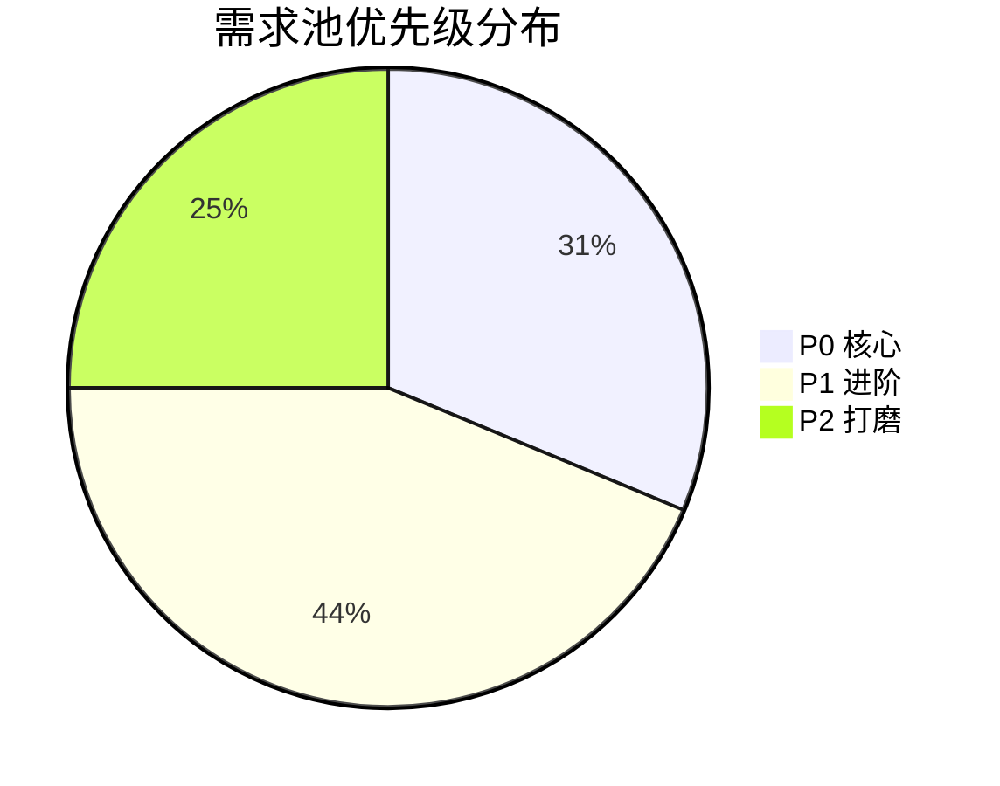

# PRD：Typo —— Typora 风格实时预览 Markdown 编辑器（v1）

> 文档版本：v1.0（简单 PRD 默认格式）
> 作者：许清楚（Xu，产品经理）
> 日期：2024-10-09
> 参考依据：团队对本地 Typora 安装目录的实地功能分析

---

## 1. 项目信息

| 项 | 内容 |
| --- | --- |
| 产品代号 | Typo（暂定，可更名） |
| 一句话定位 | 一款跨平台、所见即所得的 Markdown 编辑器，让写作像在 Typora 里一样"输入即渲染"。 |
| 桌面框架 | **Rust + Tauri v2**（macOS / Windows / Linux 三端统一） |
| 页面技术 | **Vue3 + Vite + TypeScript + HTML5 + CSS** |
| 对标产品 | Typora（参考源：`/opt/apps/io.typora.stable/files/typora/`） |
| 首版目标 | 功能面"逼近全功能"，与 Typora 核心能力对齐 |

---

## 2. 产品目标

**定位**：取代"源码/预览左右分栏"的传统 Markdown 工具，提供 Typora 式就地渲染的写作体验，并将其打包为轻量、跨平台的桌面应用。

| # | 核心目标 | 说明 |
| --- | --- | --- |
| G1 | 实时所见即所得 | 输入 Markdown 即就地渲染为富文本，零分栏、零手动切换。 |
| G2 | 覆盖核心写作场景 | 标题/列表/表格/代码/数学/图表/图片等常用块全部支持。 |
| G3 | 轻量跨平台 | 基于 Tauri，安装包 < 30MB，三端行为一致。 |
| G4 | 写作流不中断 | 自动保存 + 崩溃恢复 + 大纲导航 + 命令面板，减少鼠标与丢失风险。 |
| G5 | 可扩展外观 | 内置多套主题 + 自定义 CSS/快捷键，满足个性化。 |

---

## 3. 用户画像与用户故事

**角色**：① 写作者（内容创作、笔记）② 重度用户（长文、高频）③ 开发者（技术文档）

| # | 角色 | 用户故事（作为…我希望…以便…） |
| --- | --- | --- |
| US-01 | 写作者 | 作为写作者，我希望输入 Markdown 语法后内容就地渲染为富文本，以便专注写作而不必在源码与预览间切换。 |
| US-02 | 写作者 | 作为写作者，我希望通过文件树侧栏管理文档并拖拽打开，以便快速在不同笔记间跳转。 |
| US-03 | 写作者 | 作为写作者，我希望一键导出为 PDF/HTML/Word，以便交付给不同场景的读者。 |
| US-04 | 写作者 | 作为写作者，我希望应用自动保存并能在崩溃后恢复，以免丢失未保存的稿件。 |
| US-05 | 重度用户 | 作为重度用户，我希望用命令面板（Ctrl+Shift+P）快速执行命令，以便减少鼠标操作。 |
| US-06 | 重度用户 | 作为重度用户，我希望在大纲侧栏点击标题即可跳转到对应章节，以便长文导航。 |
| US-07 | 重度用户 | 作为重度用户，我希望自定义快捷键与主题外观，以便打造个性化写作环境。 |
| US-08 | 重度用户 | 作为重度用户，我希望开启专注/打字机模式隐藏干扰元素，以便进入深度写作状态。 |
| US-09 | 开发者 | 作为开发者，我希望插入并语法高亮多种语言的代码块，以便撰写技术文档。 |
| US-10 | 开发者 | 作为开发者，我希望编写 LaTeX 数学公式与 Mermaid 图表，以便表达算法与架构。 |
| US-11 | 开发者 | 作为开发者，我希望用表格可视编辑器增删行列与设置对齐，以便维护数据表。 |
| US-12 | 开发者 | 作为开发者，我希望文档内图片可拖拽/粘贴插入并以相对路径管理，以便仓库化协作。 |

---

## 4. 需求池（P0 / P1 / P2）

> 优先级：P0=必须（首版交付核心）｜P1=进阶（首版应交付）｜P2=打磨（首版或后续迭代）

### 4.1 P0 —— 核心（必须）

| 编号 | 名称 | 描述 | 验收标准（可量化） |
| --- | --- | --- | --- |
| REQ-P0-01 | 实时预览式编辑 | 基于 WYSIWYG 引擎，输入 Markdown 就地渲染，无源码/预览分栏。 | 输入 `# `、`**`、``` ``` ``` 等语法后 **< 200ms** 内就地渲染；支持退格回退源码态。 |
| REQ-P0-02 | 基础块渲染 | 标题、段落、有序/无序/任务列表、引用、代码块、表格、链接、图片、粗体/斜体/删除线、分隔线、脚注。 | 11 类基础块 **100%** 可渲染且样式正确；任务列表可勾选切换。 |
| REQ-P0-03 | 文件管理 | 新建 / 打开 / 保存 / 另存为；拖拽打开；最近文件列表（≥10 条）。 | 打开 ≤ 5MB 文档 **< 1s**；保存覆盖原文件且编码 UTF-8；最近列表持久化。 |
| REQ-P0-04 | 主题系统 | 至少 2 套内置主题（亮/暗），支持自定义 CSS 主题切换。 | 内置主题 ≥ 2 套；切换 **< 300ms** 无白屏；自定义 CSS 热加载生效。 |
| REQ-P0-05 | 大纲侧栏 | 依据标题自动生成可点击跳转的大纲。 | 6 级标题（H1–H6）全部收录；点击跳转定位误差 **< 1 行**；随编辑实时更新。 |

### 4.2 P1 —— 进阶（首版应交付）

| 编号 | 名称 | 描述 | 验收标准（可量化） |
| --- | --- | --- | --- |
| REQ-P1-01 | LaTeX 数学公式 | 行内 `$...$` 与块级 `$$...$$` 渲染。 | 公式渲染正确率 ≥ 95%（KaTeX 覆盖集）；块级公式居中且可滚动。 |
| REQ-P1-02 | 图表（Mermaid） | 支持流程图/时序图等 Mermaid 语法渲染。 | 常见图类型（flowchart/sequence/class）渲染成功率 ≥ 90%。 |
| REQ-P1-03 | 代码语法高亮 | 多种语言代码块高亮。 | 支持 ≥ 20 种常用语言；高亮与主题协调、无性能卡顿（>500 行流畅）。 |
| REQ-P1-04 | 表格可视编辑 | 单元格选择、增删行列、设置对齐方式。 | 选中单元格边界可见；增删行/列 **1 次点击**完成；对齐生效于渲染与导出。 |
| REQ-P1-05 | 导出 | HTML / PDF / Word(docx)。 | 三种格式导出成功率 100%；PDF 分页与主题一致；Word 保留标题层级与表格。 |
| REQ-P1-06 | 自动保存与崩溃恢复 | 本地定时自动保存 + 异常退出后可恢复。 | 每 **30s** 自动保存；崩溃重启后恢复至最近版本，提示用户选择。 |
| REQ-P1-07 | 多语言界面 | i18n 框架 + 多语言包。 | 切换语言 **< 500ms** 全界面生效；框架支持后续扩展至 30+ 语言。 |

### 4.3 P2 —— 打磨（首版或后续）

| 编号 | 名称 | 描述 | 验收标准（可量化） |
| --- | --- | --- | --- |
| REQ-P2-01 | 拼写检查 | 英文等拼写错误划线提示（可忽略/纠正）。 | 错误词下红色波浪线；误报率 < 10%；可关闭。 |
| REQ-P2-02 | 专注/打字机/源码模式 | 隐藏非必要 UI 的写作模式切换。 | 三模式一键切换；打字机模式当前行居中且高亮。 |
| REQ-P2-03 | 自定义快捷键 | 用户可重映射命令快捷键。 | 支持 ≥ 30 条命令重映射；冲突检测与持久化。 |
| REQ-P2-04 | 图片管理 | 拖拽/粘贴插入、相对路径、上传至图床。 | 粘贴/拖拽 **< 1s** 插入；默认相对路径存储；上传成功回写链接。 |

### 4.4 需求分级统计



| 分级 | 数量 | 说明 |
| --- | --- | --- |
| P0 | 5 | 首版必交付，决定产品是否"可用" |
| P1 | 7 | 首版应交付，决定产品是否"像 Typora" |
| P2 | 4 | 打磨项，可置于首版或后续迭代 |

---

## 5. UI 设计稿要点

### 5.1 主界面布局（ASCII 线框）

```
┌──────────────────────────────────────────────────────────────────┐
│ 菜单栏: 文件  编辑  视图  格式  主题  帮助            [命令面板 ⌘/Ctrl+Shift+P] │
├──────────┬───────────────────────────────────────┬────────────────┤
│ 左侧侧栏 │           编辑区 (WYSIWYG)             │  右侧面板(可选) │
│ ───────  │                                       │  ───────────   │
│ [文件树] │   # 一级标题                          │  [大纲] 默认    │
│  📁 项目 │   这是一段**加粗**与*斜体*的正文……    │   ▸ 一级标题    │
│   📄 a.md│                                       │     ▸ 二级标题  │
│   📄 b.md│   > 引用块内容                         │   ───────────   │
│ ───────  │   1. 有序项                           │  [预览/搜索]    │
│ [大纲]   │   - [ ] 任务项                         │                │
│  ▸ 标题  │   ```ts                              │                │
│    ▸ 子  │   const x = 1                        │                │
│          │   ```                                │                │
├──────────┴───────────────────────────────────────┴────────────────┤
│ 状态栏:  字数 1,234  |  行 12:列 8  |  主题: GitHub  |  中  |  ✓已保存 │
└──────────────────────────────────────────────────────────────────┘
```

- **菜单栏**：标准文件/编辑/视图/格式/主题/帮助，右侧常驻命令面板入口。
- **左侧侧栏**（可折叠）：上「文件树」、下「大纲」，Tab 或分屏切换。
- **编辑区**：居中单栏，最大宽度约 800px，留白舒适（Typora 风格）。
- **状态栏**：字数、光标行列、当前主题、语言、保存状态。

### 5.2 关键交互

| 交互 | 行为要点 |
| --- | --- |
| 就地渲染光标 | 光标在块内显示"源码态"编辑，离开块即渲染为富文本；回车/方向键在块边界智能切换。 |
| 表格编辑浮层 | 点击表格弹出浮层：选中单元格高亮，工具栏提供增/删行、增/删列、左/中/右对齐。 |
| 命令面板 | `Ctrl/Cmd+Shift+P` 唤起，模糊搜索全部命令（切换主题、插入公式、导出…）。 |
| 图片插入 | 拖拽或 `Ctrl/Cmd+V` 粘贴图片 → 默认落盘为相对路径并插入 ``。 |
| 大纲跳转 | 点击大纲项平滑滚动至对应标题，并短暂高亮。 |
| 自动保存 | 暗色/亮色状态栏「已保存」指示；异常退出后重启弹出恢复提示。 |

---

## 6. 待确认问题（Open Questions）

| # | 问题 | 建议选项（推荐 ★） |
| --- | --- | --- |
| Q1 | **WYSIWYG 引擎方案**？ | ★ **Milkdown**（ProseMirror 内核，原生 Markdown WYSIWYG，有 Vue 适配）；备选 TipTap；或自研 contenteditable（成本高、风险大）。 |
| Q2 | **导出 Word(docx) 实现路径**？ | ★ 首版调用外部 **Pandoc / LibreOffice** 桥接（Tauri 侧 command 封装）；长期内置 `docx`/`mammoth` 库避免外部依赖。需确认目标机是否预装 Pandoc。 |
| Q3 | **首版支持语言数量**？ | ★ 首版 **3 种**（简体中文 / 英文 / 繁体中文）+ 可扩展 i18n 框架；后续补齐至 30+。 |
| Q4 | **图片上传（图床）是否进首版**？ | ★ 首版本地相对路径插入即可；**上传至图床（iPic 类）后置**至 P2 后续，需另行评估后端/第三方服务。 |
| Q5 | **数学/图表/高亮依赖的包体积与离线**？ | ★ 引入 **KaTeX + Mermaid.js + Shiki/highlight.js**，打包进应用保证离线可用；需评估首版安装包 < 30MB 目标是否受影响。 |

---

## 7. 范围边界（首版不做 / 明确排除）

- 实时协作（多人同时编辑）
- 云同步账号体系（首版仅本地文件）
- 内置图床上传后端服务
- 插件市场（首版不支持第三方插件）

---

*—— 由产品经理许清楚产出，供架构师评估技术选型与排期。*
